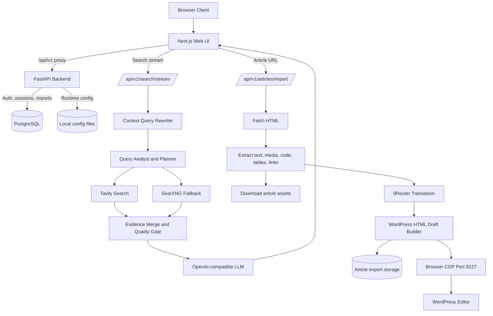

<div align="center">

# Web Agent Craw Blog

**AI-powered web search, article crawling, translation, and WordPress draft automation platform.**


[Overview](#overview) . [System Flow](#system-flow) . [Quick Start](#quick-start) . [Pipelines](#application-pipelines) . [Repository Map](#repository-map) . [Docs](#docs-index)

</div>

---

## Overview

Web Agent Craw Blog is a production-oriented web application for research-assisted content operations. It combines a Tavily-first search assistant, SearXNG fallback retrieval, OpenAI-compatible LLM summarization, article URL import, structured content extraction, translation through 9Router, and WordPress draft automation through a browser CDP session.

| Component | Tech Stack | Current State |
|---|---|---|
| **Backend API** | FastAPI + Pydantic Settings + SQLAlchemy + Alembic | Implemented: search streaming, article import, LLM runtime config, auth/session stores, RBAC flags, audit/system endpoints |
| **Frontend UI** | Next.js + React + TypeScript + Tailwind CSS | Implemented: chat-style search UI, settings, Article Import workflow, Ops Dashboard, session history, runtime status panels |
| **Search Pipeline** | Tavily + SearXNG + HTTPX | Implemented: Tavily-first retrieval, SearXNG fallback, query expansion, evidence merge, confidence and quality gates |
| **Article Pipeline** | BeautifulSoup + asset downloader + 9Router | Implemented: HTML block extraction, media/code/table/list/link preservation, batched translation, partial retry/resume behavior |
| **Automation Layer** | Playwright/CDP + Chrome/Brave/Edge | Implemented: WordPress dry-run validation and draft paste automation through a dedicated browser debugging port |
| **Infrastructure** | PostgreSQL + Docker Compose + local scripts | Implemented: cross-platform setup/run/stop scripts, optional Postgres/pgAdmin/SearXNG/9Router/browser startup, production compose profile |

---

## System Flow



---

## Quick Start

All commands must be executed from the `web-agent/` repository root.

### 1. Centralized Environment Configuration

Create the root `.env` file from the committed example:

```bash
cp .env.example .env
```

Windows PowerShell:

```powershell
Copy-Item .env.example .env -Force
```

### 2. Setup Dependencies

Run the cross-platform setup script for your host OS.

Linux/macOS/Git Bash:

```bash
./setup.sh
```

Windows PowerShell:

```powershell
powershell.exe -NoProfile -ExecutionPolicy Bypass -File .\setup.ps1
```

### 3. Start Application

Linux/macOS/Git Bash:

```bash
./run.sh
```

Windows PowerShell:

```powershell
powershell.exe -NoProfile -ExecutionPolicy Bypass -File .\run.ps1
```

### 4. Open Local Services

| Service | URL |
|---|---|
| **Frontend** | `http://localhost:3005` |
| **Backend API** | `http://127.0.0.1:8011` |
| **API Docs** | `http://127.0.0.1:8011/docs` |
| **9Router Dashboard** | `http://localhost:20128/dashboard` |
| **WordPress Browser CDP** | `http://127.0.0.1:9227` |

### 5. Stop Application

Linux/macOS/Git Bash:

```bash
./stop.sh
```

Windows PowerShell:

```powershell
powershell.exe -NoProfile -ExecutionPolicy Bypass -File .\stop.ps1
```

---

## Manual Start (Local Development)

Use this when running backend and frontend directly instead of the helper scripts.

### 1. Backend API

```bash
cd backend
python -m venv .venv
source .venv/bin/activate
pip install -e ".[dev]"
uvicorn src.web_search_backend.main:app --host 127.0.0.1 --port 8011 --reload
```

Windows PowerShell:

```powershell
cd backend
python -m venv .venv
.\.venv\Scripts\activate
pip install -e ".[dev]"
uvicorn src.web_search_backend.main:app --host 127.0.0.1 --port 8011 --reload
```

### 2. Frontend UI

```bash
cd frontend
npm install
npm run dev
```

### 3. Optional Infrastructure

Enable optional local services in the root `.env` before setup:

```env
POSTGRES_AUTO_START=true
PGADMIN_AUTO_START=true
SEARXNG_AUTO_START=true
NINEROUTER_AUTO_START=true
WP_CHROME_AUTO_START=true
```

Production-style Docker profile:

```bash
docker compose -f docker-compose.production.yml up -d --build
```

---

## Application Pipelines

### Search Assistant Pipeline

| Step | Component | Action |
|---:|---|---|
| 1 | Browser UI | User sends a chat-style search question |
| 2 | Backend API | Streams through `/api/v1/search/stream` |
| 3 | Query Rewriter | Builds context-aware follow-up queries from session history |
| 4 | Query Planner | Expands the query and selects retrieval strategy |
| 5 | Tavily/SearXNG | Fetches web evidence through Tavily first and SearXNG fallback |
| 6 | Evidence Merge | Deduplicates sources, scores quality, and prepares context |
| 7 | LLM Summarizer | Calls an OpenAI-compatible model for the final answer |
| 8 | Browser UI | Displays answer, sources, confidence, and session state |

### Article Import / Craw Blog Pipeline

| Step | Component | Action |
|---:|---|---|
| 1 | Article Import UI | User submits a source article URL |
| 2 | Backend Importer | Fetches source HTML and extracts structured content blocks |
| 3 | Asset Downloader | Downloads media and prepares local import assets |
| 4 | Link Preserver | Replaces links with placeholders such as `[LINK_n:label]` before translation |
| 5 | 9Router Client | Translates missing text blocks in bounded batches with retry/resume support |
| 6 | Draft Builder | Restores links and generates WordPress-ready HTML |
| 7 | CDP Automation | Runs dry-run validation or pastes title/content into WordPress editor |

### Auth, Settings, and Ops Pipeline

| Step | Component | Action |
|---:|---|---|
| 1 | Settings UI | Manages Tavily keys, LLM runtime config, account controls, and ops panels |
| 2 | Backend Gateway | Applies auth/session storage and optional RBAC controls |
| 3 | Config Store | Persists local runtime configuration files under backend config paths |
| 4 | Ops Dashboard | Checks Tavily, LLM, 9Router, audit logs, and system status |
| 5 | CI | Runs backend tests, frontend lint, and frontend build in GitHub Actions |

---

## Deployment Profiles

| Profile | Cwd / Entry point | Description | Ports (Host) |
|---|---|---|---|
| **Frontend UI** | `frontend/` | Next.js application and browser-facing interface | `3005` |
| **Backend API** | `backend/` | FastAPI gateway for search, article import, settings, auth, and ops | `8011` |
| **PostgreSQL** | `docker-compose.production.yml` | Persistent auth/session/import database | `5432` |
| **pgAdmin** | setup scripts | Optional PostgreSQL admin UI | `5050` |
| **SearXNG** | setup scripts | Optional local fallback search provider | `8080` |
| **9Router** | setup scripts | Optional OpenAI-compatible translation endpoint | `20128` |
| **Browser CDP** | `scripts/start_wp_chrome.*` | Chrome/Brave/Edge debugging target for WordPress automation | `9227` |

---

## Repository Map

```text
.
|-- backend/                         FastAPI backend service
|   |-- alembic/                     Database migrations
|   |-- config/                      Local runtime config files
|   |-- scripts/                     Backend utility scripts
|   |-- src/                         Application source package
|   |-- tests/                       Backend test suite
|   |-- Dockerfile                   Backend container image
|   `-- pyproject.toml               Python package and test config
|
|-- frontend/                        Next.js dashboard and workflow UI
|   |-- src/                         App routes, UI components, services, and styles
|   |-- public/                      Static frontend assets
|   |-- Dockerfile                   Frontend container image
|   `-- package.json                 Node scripts and dependencies
|
|-- docs/                            Architecture, setup, CI/CD, and operations docs
|-- plans/                           Historical implementation plans
|-- scripts/                         Cross-service helper scripts
|-- config/                          Local helper configuration
|-- .github/workflows/               GitHub Actions CI
|-- docker-compose.production.yml    Production-style Docker Compose profile
|-- setup.sh / setup.ps1             Cross-platform setup entry points
|-- run.sh / run.ps1                 Cross-platform run entry points
|-- stop.sh / stop.ps1               Cross-platform stop entry points
|-- delete.sh / delete.ps1           Local Docker cleanup helpers
`-- .env.example                     Master environment template
```

---

## Docs Index

Detailed design and operations documents are maintained under `docs/`:

| Document | Purpose |
|---|---|
| [**`docs/README.md`**](docs/README.md) | Documentation index |
| [**`architecture-pipeline.md`**](docs/architecture-pipeline.md) | Search and Article Import architecture flow |
| [**`setup-cross-platform.md`**](docs/setup-cross-platform.md) | Windows, Linux, macOS, and Git Bash setup instructions |
| [**`env-reference.md`**](docs/env-reference.md) | Environment variable reference |
| [**`ci-cd.md`**](docs/ci-cd.md) | CI/CD workflow and production notes |
| [**`production-readiness-report.md`**](docs/production-readiness-report.md) | Production readiness checklist and gaps |
| [**`task-web-search-implementation.md`**](docs/task-web-search-implementation.md) | Web search implementation task notes |
| [**`blog-brief.md`**](docs/blog-brief.md) | Blog/content workflow brief |

---

## Configuration Reference

Read runtime values from the root `.env` file and service-specific generated env files.

| Setting | Default | Purpose |
|---|---|---|
| `BACKEND_PORT` | `8011` | Backend API host port |
| `FRONTEND_PORT` | `3005` | Frontend dev or production host port |
| `LLM_BASE_URL` | auto-detected or `http://127.0.0.1:8007/v1` | OpenAI-compatible summarization endpoint |
| `LLM_MODEL` | `google/gemma-4-E4B-it` | Default model for search summary |
| `SEARXNG_PORT` | `8080` | Optional local SearXNG fallback port |
| `NINEROUTER_BASE_URL` | `http://127.0.0.1:20128/v1` | 9Router OpenAI-compatible API |
| `NINEROUTER_DASHBOARD_URL` | `http://localhost:20128/dashboard` | 9Router dashboard URL |
| `WP_CHROME_PORT` | `9227` | Browser CDP port for WordPress automation |
| `POSTGRES_PORT` | `5432` | Optional local PostgreSQL port |
| `PGADMIN_PORT` | `5050` | Optional pgAdmin UI port |

---

## Testing and CI

Run backend tests:

```bash
cd backend
python -m pytest -q
```

Run frontend checks:

```bash
cd frontend
npm run lint
npm run build
```

GitHub Actions currently runs backend tests, frontend lint, and frontend build on `push`, `pull_request`, and `workflow_dispatch`.

---

## Operations Notes

- **Search resilience**: Tavily is the primary provider. Local SearXNG can be enabled when public instances return `403` or `429`.
- **Article translation resume**: Article Import only translates blocks that do not yet have `translated_text`, so partial runs can be continued.
- **Link preservation**: Inline links are protected through placeholders before translation and restored when rendering the final draft.
- **WordPress safety**: Dry Run checks the browser/CDP target before content is pasted into the editor.
- **Secret hygiene**: Do not commit `.env`, `backend/.env`, `frontend/.env.local`, API keys, logs, browser profiles, or imported private content.
- **Local config hygiene**: Do not commit `backend/config/tavily_keys.json` or `backend/config/llm_runtime.json` if they contain private endpoints or keys.
