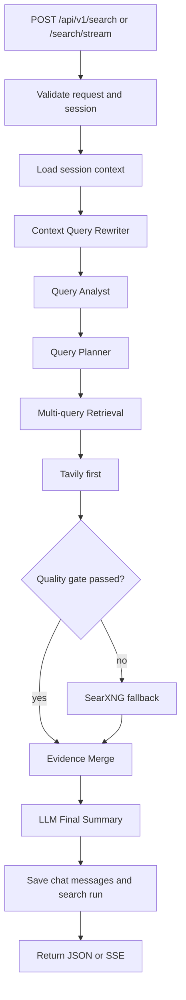
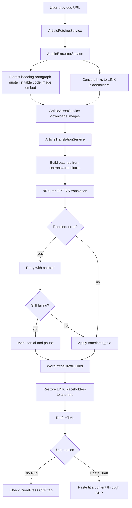
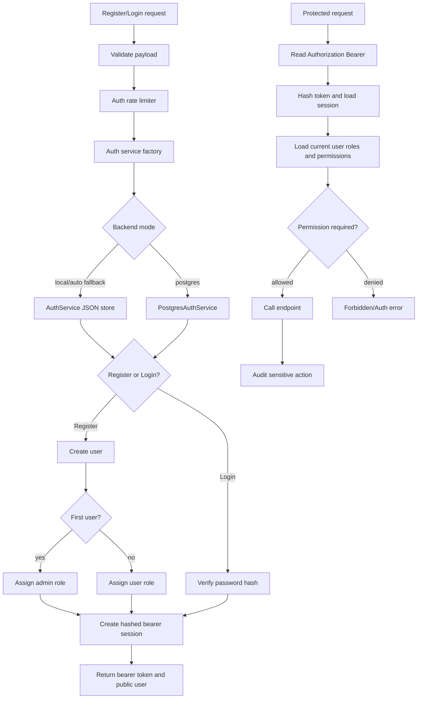
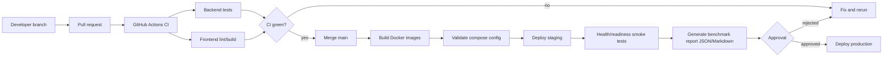
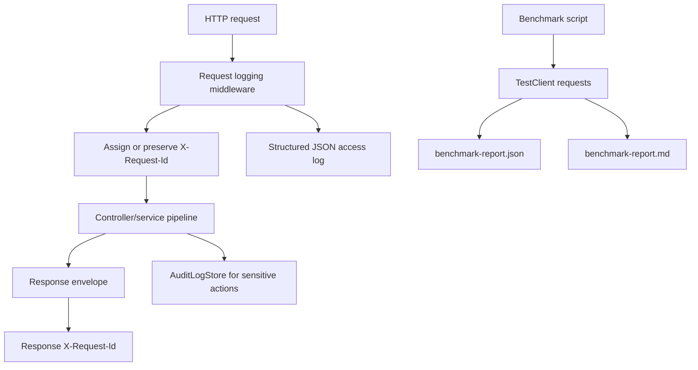

# Kiến trúc và pipeline Web Agent

Tài liệu này mô tả Web Agent đang làm gì, các thành phần chính và luồng xử lý end-to-end.

## Mục tiêu dự án

Web Agent là hệ thống web search dạng chat. Người dùng nhập câu hỏi, hệ thống tìm kiếm nguồn web, đánh giá chất lượng nguồn và dùng LLM để tổng hợp câu trả lời cuối cùng.

Mục tiêu chính:

- trả lời dựa trên nguồn web có thể kiểm chứng;
- ưu tiên dữ liệu mới qua Tavily/SearXNG;
- giữ trải nghiệm chat tự nhiên;
- hỗ trợ lịch sử hội thoại trong cùng session;
- cho phép quản trị prompt, model và runtime config mà không cần sửa code.

## Thành phần ứng dụng

### Frontend

Thư mục: `frontend/`

- Next.js 16 + React 19.
- Chat workspace, sidebar lịch sử, settings modal.
- `SearchWorkspace.tsx`: shell chính của chat, submit query, streaming UI.
- `SearchResultPanel.tsx`: hiển thị câu trả lời, sources, attempts, debug trace.
- `PromptManagerPopup.tsx`: chỉnh prompt và target output length.
- `OpsDashboard.tsx`: health/test LLM, metrics và audit logs.
- `apiClient.ts`: gọi REST API và đọc SSE stream.

### Backend

Thư mục: `backend/`

- FastAPI.
- Controllers:
  - `search_controller.py`
  - `chat_controller.py`
  - `llm_controller.py`
- Services chính:
  - `context_query_rewriter_service.py`
  - `query_analyst_service.py`
  - `query_planner_service.py`
  - `tavily_service.py`
  - `searxng_service.py`
  - `evidence_merge_service.py`
  - `llm_summary_service.py`
  - `llm_runtime_store.py`
  - `chat_session_store.py`
  - `postgres_chat_session_store.py`
  - `query_cache.py`

### Local infra tùy chọn

- PostgreSQL: lưu session/search trace.
- pgAdmin: quản trị DB local.
- SearXNG: fallback search local ổn định hơn public instances.
- 9Router: OpenAI-compatible router cho Article Import translation.
- Chrome/Brave/Edge CDP: browser profile riêng để kiểm tra/paste draft vào WordPress.

## Pipeline xử lý



## Context Query Rewriter

File: `backend/src/services/context_query_rewriter_service.py`

Nhiệm vụ:

- đọc các tin nhắn trước trong cùng session;
- hiểu câu hỏi nối tiếp kiểu “vậy người đứng đầu công ty là ai?”;
- viết lại query thành câu hỏi đầy đủ hơn trước khi search;
- không bắt người dùng phải nói rõ “dựa vào lịch sử”.

Ví dụ:

```text
User trước: Cho tôi biết về Nhất Tiến Chung
User sau: Vậy người đứng đầu công ty là ai?
Query rewrite: Người đứng đầu Công ty TNHH Tin Học Viễn Thông Nhất Tiến Chung là ai?
```

## Query Analyst

File: `backend/src/services/query_analyst_service.py`

Nhiệm vụ:

- chuẩn hoá câu hỏi;
- nhận diện intent như `definition`, `architecture`, `comparison`, `general_exploration`;
- sinh sub-query để tăng coverage.

Mode:

- `rule`: dùng rule/template nội bộ;
- `llm`: gọi LLM để sinh sub-query, fallback về rule nếu lỗi.

## Query Planner

File: `backend/src/services/query_planner_service.py`

Nhiệm vụ:

- ước lượng độ phức tạp: `simple`, `medium`, `complex`;
- chọn budget truy vấn;
- ưu tiên sub-query quan trọng.

## Retrieval

File: `backend/src/services/search_orchestrator.py`

Nhiệm vụ:

- chạy nhiều sub-query có giới hạn;
- dùng cache cho query chính và sub-query;
- gọi Tavily trước;
- fallback sang SearXNG khi Tavily không đủ tốt.

## Tavily-first

File: `backend/src/services/tavily_service.py`

Tavily là provider ưu tiên vì trả kết quả web trực tiếp và metadata tốt. Tavily key được quản lý qua `TavilyKeyStore`:

- thêm/list/xoá key;
- mask key khi hiển thị;
- chọn key khả dụng;
- ghi success/failure;
- cooldown khi rate limit hoặc lỗi.

## SearXNG fallback

File: `backend/src/services/searxng_service.py`

Fallback được dùng khi:

- không có Tavily key khả dụng;
- Tavily lỗi/rate limit;
- kết quả Tavily không đạt quality gate;
- cần test fallback local.

Hardening:

- throttle QPS;
- circuit breaker;
- backup base URLs;
- khuyến nghị self-host local cho dev.

## Evidence Merge

File: `backend/src/services/evidence_merge_service.py`

Nhiệm vụ:

- hợp nhất source từ nhiều query;
- lọc trùng URL;
- giữ nguồn tốt nhất theo score/top-k;
- xuất metadata để debug.

## Quality Gate

Quality gate quyết định có cần extra retrieval round hay không:

- coverage thấp;
- thiếu số lượng nguồn tối thiểu;
- thiếu domain đa dạng;
- còn fallback query có thể chạy.

## LLM Final Summary

File: `backend/src/services/llm_summary_service.py`

Nhiệm vụ:

- build prompt từ query + sources;
- gọi `/chat/completions` OpenAI-compatible;
- dùng `max_tokens` theo chuẩn token của OpenAI-compatible API;
- ưu tiên trả lời bằng tiếng Việt khi người dùng hỏi tiếng Việt;
- dùng runtime prompt từ Prompt Manager;
- fallback deterministic summary nếu LLM lỗi.

Lưu ý quan trọng:

- `max_tokens` là token budget, không phải ký tự.
- `summary_max_tokens` là target độ dài phần tóm tắt cuối theo token.
- Không nên cắt output bằng số ký tự nếu mục tiêu là kiểm soát theo token.

## Article Import / Craw Blog pipeline

Endpoint chính:

- `POST /api/v1/articles/import`
- `POST /api/v1/articles/import/{run_id}/translate`
- `POST /api/v1/articles/import/{run_id}/wordpress/dry-run`
- `POST /api/v1/articles/import/{run_id}/wordpress/paste`

Luồng xử lý:



Extractor coverage hiện tại:

- `h1`-`h6`: heading.
- `p`: paragraph.
- `blockquote`: quote.
- `ul`/`ol`: list block; `li` rời có fallback paragraph.
- `pre`: code block thật.
- `code`: inline code, giữ trong paragraph/list, không tách thành code block riêng.
- `figure`, `figcaption`, `img`: image + caption.
- `iframe`, `video`: embed.
- `table`: table block.
- `a`: link được thay bằng placeholder `[LINK_n:label]` trong text để sống qua dịch.

Translation provider:

- Provider metadata: `9router_openai`.
- Model mặc định: `cx/gpt-5.5`.
- Prompt yêu cầu giữ `LINK_n`, giữ inline code/API/model names trong câu, chỉ copy nguyên source cho code block thật.

## Auth/RBAC pipeline

Endpoint hiện tại:

- `POST /api/v1/auth/register`
- `POST /api/v1/auth/login`
- `GET /api/v1/auth/me`
- `POST /api/v1/auth/logout`

Runtime auth dùng factory chọn `AuthService` file-backed cho local/dev hoặc `PostgresAuthService` cho production khi `APP_AUTH_STORE_BACKEND=postgres`. Cả hai mode đều hash bearer token, không trả password/session secret qua API, và enforce permission checks cho endpoint nhạy cảm.



Bearer RBAC đang áp dụng cho:

- Tavily key mutation: `keys:tavily_manage`.
- LLM config/test mutation: `llm:config_manage`.
- Article Import import/translate/dry-run/paste: `article:*` permissions tương ứng.
- Admin users/audit/system status: `admin:users_read`, `admin:users_manage`, `admin:roles_manage`, `ops:audit_read`.

Production compose sets `APP_AUTH_STORE_BACKEND=postgres` and `APP_SESSION_STORE_BACKEND=postgres`, so auth/session state is durable in PostgreSQL while local/dev can keep JSON fallback.

## Deployment pipeline target



Production artifacts hiện có:

- `backend/Dockerfile`, `frontend/Dockerfile`.
- `docker-compose.production.yml`.
- `.env.production.example`.
- `GET /api/v1/ready` cho readiness.
- `backend/scripts/benchmark_report.py` tạo benchmark JSON/Markdown cho health, readiness, auth, admin monitoring và search mock.

## SSE streaming

Endpoint: `POST /api/v1/search/stream`

Event:

- `status`: trạng thái pipeline.
- `token`: chunk nội dung trả lời.
- `done`: final `SearchResultData`.
- `error`: lỗi có `code`, `message`, `details`.

Frontend dùng các status này để hiển thị “đang rewrite context”, “đang search”, “đang tổng hợp bằng LLM” theo từng chat bubble.

## Data và session

Session store có 2 mode:

- local JSON;
- PostgreSQL.

Mỗi session có thể lưu:

- title;
- messages;
- metadata;
- search runs;
- attempts;
- sources;
- query analysis;
- rewritten query.

## Feature flags

- `FEATURE_SESSION_HISTORY`
- `FEATURE_OPS_DASHBOARD`
- `FEATURE_LLM_RUNTIME_CONFIG`

Backend dùng prefix `APP_`, frontend dùng `NEXT_PUBLIC_`.

## Observability

Hệ thống có:

- provider attempts trong response;
- query analysis fields;
- source count/attempt count;
- audit logs cho thao tác nhạy cảm;
- LLM health/test endpoint;
- Tavily key metrics;
- `X-Request-Id` trên response;
- backend access log dạng JSON gồm method, path, status, duration, request id;
- benchmark artifacts JSON/Markdown từ `backend/scripts/benchmark_report.py`.


